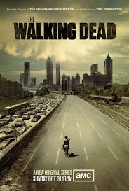

# The Walking Dead - 11 Seasons

	
## About The Walking Dead

*“The Walking Dead” is a story about people trying to survive after zombies take over the world. A man named Rick wakes up from a coma and finds everything destroyed. He meets other survivors and they work together to stay alive. They fight zombies, but the real danger often comes from other people. The show is about survival, trust, and how people change when the world falls apart.*

## My favorite character in the whole series is Daryl Dixon

### Some interesting facts about this character
*Daryl is not in the original comics. He was made only for the TV show.
He is very skilled with a crossbow and is one of the best trackers in the group.
At first, he was angry and didn’t trust people, but he later became one of the most loyal members.
His close bond with Carol is one of the strongest friendships in the series.
He is known for being quiet, tough, and protective, especially of kids like Judith.
Norman Reedus, the actor who plays Daryl, loved the character so much that he continued in his own spin-off series.*

## Summary of The Walking Dead Seasons (1–11)

| Season | Main Focus                   | Big Enemy/Group     | Key Idea              |
|--------|-------------------------------|-----------------------|------------------------|
| 1      | Rick wakes up and finds survivors | Walkers              | Learning to survive    |
| 2      | Life on the farm             | Walkers               | Family and trust       |
| 3      | Prison life                  | The Governor          | Safety vs danger       |
| 4      | Prison falls                 | Walkers               | Staying together       |
| 5      | Journey to Washington        | Terminus              | Hope and fear          |
| 6      | Alexandria life              | Wolves                | Community struggles    |
| 7      | Fighting back                | Negan & Saviors       | Power and control      |
| 8      | All-out war                  | Negan                 | Freedom                |
| 9      | Time skip                    | Whisperers            | New rules              |
|10      | Whisperer War                | Whisperers            | Strength and unity     |
|11      | Rebuilding                   | Commonwealth          | Hope for the future    |

For more information visit the official website: [The Walking Dead](https://www.amc.com/shows/the-walking-dead--1002293)
